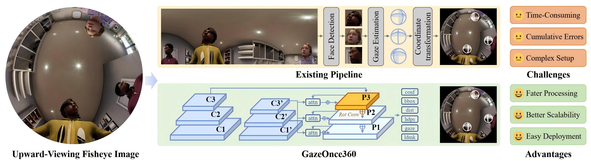

<div align="center">

<h1>GazeOnce360: Fisheye-Based 360° Multi-Person Gaze Estimation with Global-Local Feature Fusion</h1>


<a href="https://arxiv.org/abs/2603.17161"></a>
<a href="https://caizhuojiang.github.io/GazeOnce360/"></a>
<a href="https://huggingface.co/datasets/caizhuojiang/MPSGaze360"></a>





<i>GazeOnce360 presents an efficient, end-to-end solution for multi-person 3D gaze estimation from a fisheye perspective.</i>

</div>


## 🚀 Environment Setup

1. Create and activate the environment.

```bash
conda create -n gazeonce360 python=3.10 -y
conda activate gazeonce360
```

2. Install PyTorch and torchvision.

```bash
# Example for CUDA 12.1
pip install torch==2.5.1+cu121 torchvision==0.20.1+cu121 --index-url https://download.pytorch.org/whl/cu121
```

3. Install project dependencies.

```bash
pip install -r requirements.txt
```

## 📦 Dataset Preparation


Download the MPSGaze360 dataset from [MPSGaze360](https://huggingface.co/datasets/caizhuojiang/MPSGaze360). 
After downloading, extract and place the training subset 0 in the following structure:

```text
data
└── MPSGaze360_train_0
    ├── labels.txt
    └── images
```

## 🏋️ Training

Start training with default settings:

```bash
python train.py
```

Training logs are written to `runs/`, and checkpoints are saved to `checkpoints/`.

## 🙏 Acknowledgements

Our work builds upon several fantastic open-source projects. We'd like to express our gratitude to the authors of:

* [Pytorch_Retinaface](https://github.com/biubug6/Pytorch_Retinaface)
* [Rotational-Convolution-for-downside-fisheye-images](https://github.com/wx19941204/Rotational-Convolution-for-downside-fisheye-images)
* [GrouPy](https://github.com/tscohen/GrouPy)


## 📝 Citation

If you find this work useful, please cite our paper:

```bibtex
@misc{cai2026gazeonce360fisheyebased360degmultiperson,
      title={GazeOnce360: Fisheye-Based 360{\deg} Multi-Person Gaze Estimation with Global-Local Feature Fusion}, 
      author={Zhuojiang Cai and Zhenghui Sun and Feng Lu},
      year={2026},
      eprint={2603.17161},
      archivePrefix={arXiv},
      primaryClass={cs.CV},
      url={https://arxiv.org/abs/2603.17161}, 
}
```
